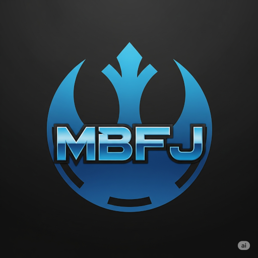

# E-commerce Empresa X

Este é um projeto para **Empresa X**, feito em *PHP e MySQL*

## Funcionalidades:

Checkout, tela de produto, Catálago, Home com Banner

###### Melhorias do projeto:

Melhoria 1, Melhoria 2, Melhoria 3

**Esse é um texto em negrito**

*Esse é um texo em italico*

### Linguagens do projeto:

* HTML
* CSS
* JavaScript
* PHP
* MySQL

### Funcionalidades a desenvolver: 

1. Área de membros
2. Integração com outros pagamentos
3. Sistema de bônus primeira compra

### Imagem local

### links

[Google](https://www.google.com)

